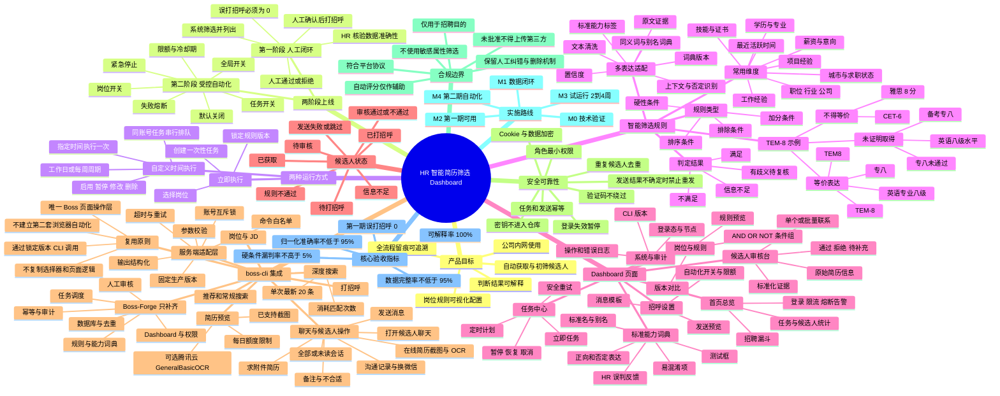

# HR Dashboard 需求思维导图

```mermaid
mindmap
  root((HR 智能简历筛选 Dashboard))
    产品目标
      岗位规则可视化配置
      自动获取与初筛候选人
      判断结果可解释
      全流程留痕可追溯
      公司内网使用
    两阶段上线
      第一阶段 人工闭环
        系统筛选并列出
        HR 核验数据准确性
        人工通过或拒绝
        人工确认后打招呼
        误打招呼必须为 0
      第二阶段 受控自动化
        默认关闭
        全局开关
        岗位开关
        任务开关
        限额与冷却期
        失败熔断
        紧急停止
    两种运行方式
      立即执行
        选择岗位
        锁定规则版本
        创建一次性任务
      自定义时间执行
        指定时间执行一次
        工作日或每周周期
        启用 暂停 修改 删除
        同账号任务串行排队
    智能筛选规则
      规则类型
        硬性条件
        加分条件
        排除条件
        排序条件
      常用维度
        城市与求职状态
        工作经验
        学历与专业
        职位 行业 公司
        技能与证书
        项目经验
        薪资与意向
        最近活跃时间
      多表达适配
        文本清洗
        同义词与别名词典
        上下文与否定识别
        标准能力标签
        置信度
        原文证据
        词典版本
      TEM-8 示例
        等价表达
          英语专业八级
          专八
          TEM-8
          TEM8
        不得等价
          CET-6
          雅思 8 分
        未证明取得
          备考专八
          专八未通过
          英语八级水平
      判定结果
        满足
        不满足
        信息不足
        有歧义待复核
    Dashboard 页面
      首页总览
        招聘漏斗
        任务与候选人统计
        登录 限流 熔断告警
      岗位与规则
        AND OR NOT 条件组
        规则预览
        版本对比
      标准能力词典
        标准名与别名
        正向和否定表达
        易混淆项
        测试框
        HR 误判反馈
      任务中心
        立即任务
        定时计划
        暂停 恢复 取消
        安全重试
      候选人审核台
        原始简历信息
        标准化证据
        通过 拒绝 待补充
        单个或批量联系
      招呼设置
        消息模板
        发送预览
        自动化开关与限额
      系统与审计
        登录态与节点
        CLI 版本
        操作和错误日志
    候选人状态
      已获取
      信息不足
      规则不通过
      待审核
      审核通过或不通过
      待打招呼
      已打招呼
      发送失败或跳过
    boss-cli 集成
      复用原则
        唯一 Boss 页面操作层
        通过锁定版本 CLI 调用
        不复制选择器和页面逻辑
        不建立第二套浏览器自动化
      岗位与 JD
      推荐和常规搜索
      深度搜索
        单次最新 20 条
        消耗匹配次数
      简历预览
        每日额度限制
        已支持截图
        可选腾讯云 GeneralBasicOCR
      打招呼
      聊天与候选人操作
        全部或未读会话
        打开候选人聊天
        发送消息
        求附件简历
        在线简历截图与 OCR
        备注与不合适
        沟通记录与换微信
      服务端适配层
        命令白名单
        参数校验
        超时与重试
        账号互斥锁
        输出结构化
        固定生产版本
      Boss-Forge 只补齐
        Dashboard 与权限
        任务调度
        规则与能力词典
        人工审核
        数据库与去重
        幂等与审计
    安全可靠性
      角色最小权限
      Cookie 与数据加密
      密钥不进入仓库
      任务和发送幂等
      重复候选人去重
      登录失效暂停
      验证码不绕过
      发送结果不确定时禁止重发
    合规边界
      符合平台协议
      仅用于招聘目的
      不使用敏感属性筛选
      未批准不得上传第三方
      保留人工纠错与删除机制
      自动评分仅作辅助
    实施路线
      M0 技术验证
      M1 数据闭环
      M2 第一期可用
      M3 试运行 2到4周
      M4 第二期自动化
    核心验收指标
      数据完整率不低于 95%
      归一化准确率不低于 95%
      硬条件漏判率不高于 5%
      可解释率 100%
      第一期误打招呼 0
```
