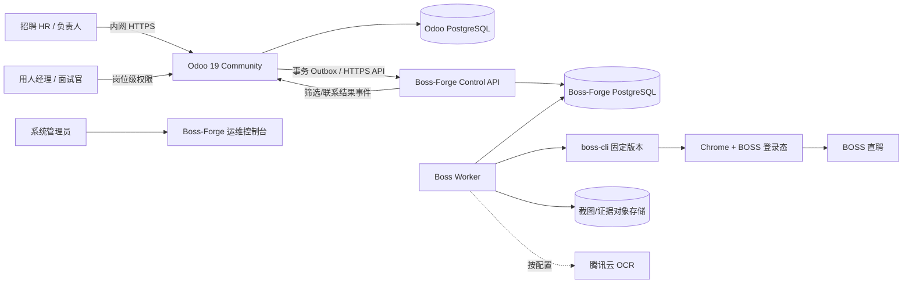
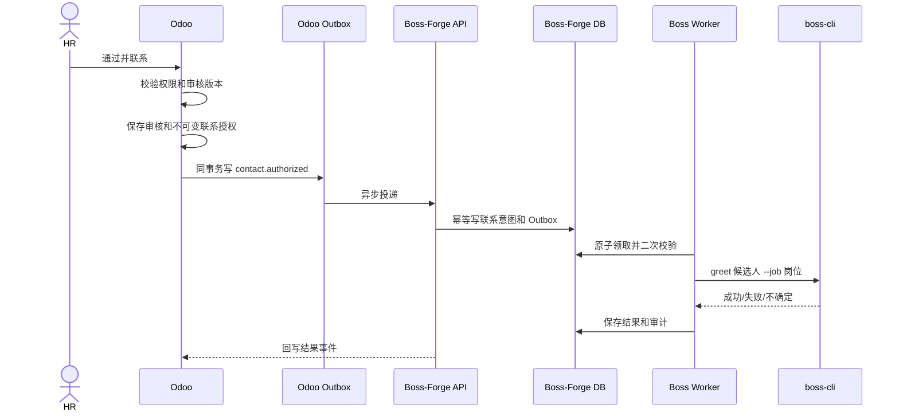

# Boss-Forge 基于 Odoo Community Recruitment 的重构设计

> 文档版本：V1.1（增加 985/211 院校筛选设计）
>
> 编写日期：2026-08-31
>
> 目标基线：Odoo 19 Community + `hr_recruitment`
>
> 使用范围：公司内网 HR 部门
>
> 关联文档：[产品需求文档](HR_DASHBOARD_PRD.md) · [现有系统架构](SYSTEM_ARCHITECTURE.md) · [boss-cli 复用清单](BOSS_CLI_REUSE_MATRIX.md)
>
> 实施状态：R0-R4 技术基础与 Fake 联系闭环已进入验收；R5-R6、真实联系启用和生产数据迁移不在本轮开启。实际交付与测试结果见 [重构实施报告](ODOO_REFACTOR_IMPLEMENTATION_REPORT.md)。

## 1. 文档目的

本文定义 Boss-Forge 从“单 HR、单一 TEM8 规则的招聘自动化验证系统”重构为“HR 部门共用的 BOSS 招聘作业平台”的目标架构和实施路径。

重构采用以下总体方案：

- 使用 Odoo Community Recruitment 承担用户、组织、岗位、候选人流程、协作、活动、人才库和基础报表。
- 保留 Boss-Forge 已完成的 `boss-cli` 适配、BOSS 登录态、候选人采集、简历预览、OCR、规则执行、任务调度、联系策略、Outbox、幂等和审计能力。
- 新建 Odoo 自定义 Addons，把岗位规则、BOSS 账号、筛选结果、审核动作和联系状态嵌入 Odoo 招聘界面。
- HR 审核通过即视为联系授权，系统自动进入打招呼队列，不再要求 HR 再点击一次“创建联系任务”。
- Odoo 与 Boss-Forge 使用独立 PostgreSQL 数据库，通过版本化 API 和事务 Outbox 集成，禁止跨库直写。

本文是后续数据模型、服务边界、接口、迁移、部署、测试和验收的开发依据。

## 2. 架构决策摘要

### 2.1 决策

选择 Odoo 19 Community 的 `hr_recruitment` 作为 HR 业务控制面，Boss-Forge 转型为 BOSS 招聘自动化执行与决策服务。

### 2.2 为什么不继续自行开发完整 ATS

现有 Boss-Forge 已经具备招聘渠道自动化的差异化能力，但自行补齐以下通用 ATS 功能成本高、收益低：

- 用户、组织、公司、部门和权限。
- 岗位负责人、面试人员和招聘协作。
- 候选人 Kanban 流程、活动、附件、备注和消息时间线。
- 人才库、拒绝原因、面试排期和基础招聘分析。
- 多语言、时区、邮件、日历和后台管理。

Odoo 19 Community 的 `hr_recruitment` 已提供招聘岗位 `hr.job`、候选申请 `hr.applicant`、招聘阶段 `hr.recruitment.stage`、人才库、标签、活动、面试人员、附件、来源和招聘基础权限。官方模块清单见 [Odoo `hr_recruitment` manifest](https://github.com/odoo/odoo/blob/19.0/addons/hr_recruitment/__manifest__.py)。

### 2.3 为什么不把 Boss-Forge 逻辑全部写进 Odoo

以下能力依赖浏览器、Chrome 登录态、`boss-cli` 子进程、OCR、长任务和不确定外部操作，不适合放在 Odoo Web 请求中执行：

- BOSS 推荐、搜索、深度搜索和简历预览。
- Chrome 用户目录、Cookie、登录状态和账号级串行锁。
- 截图、OCR、输出解析和原始产物管理。
- 可能运行数分钟的采集和筛选任务。
- 需要严格幂等、限额、熔断和“不确定时不重试”的打招呼任务。

因此 Odoo 只发出业务意图，Boss-Forge Worker 负责执行。Odoo 请求事务中不得同步等待 `boss-cli`。

### 2.4 为什么不直接 Fork Odoo 核心源码

采用官方镜像加自定义 Addons，不修改 `odoo/odoo` 核心代码：

- 使用 `_inherit` 扩展 `hr.job`、`hr.applicant` 和 `res.users`。
- 使用 XML 继承视图增加字段、页签、按钮、菜单和搜索条件。
- 使用独立模型保存规则版本、任务镜像、审核授权和集成事件。
- 使用 ACL 和 Record Rules 扩展岗位级权限。
- 使用自定义 HTTP Controller 提供最小集成 API。

这样可以按固定版本升级 Odoo，减少长期维护大型核心 Fork 的成本。

## 3. 产品重新定位

### 3.1 一句话目标

每位 HR 可以管理自己负责的岗位和招聘规则；系统自动从正确的 BOSS 账号采集、预览和筛选候选人；HR 审核后自动打招呼；团队共享候选人资产、联系历史和招聘数据，同时避免重复联系和账号误用。

### 3.2 目标用户

| 角色 | 主要职责 | 默认数据范围 |
|---|---|---|
| 招聘 HR | 管理负责岗位、运行筛选、审核候选人、跟进回复 | 自己负责或协作的岗位 |
| HR 负责人 | 分配岗位、审核规则模板、查看团队进展、控制自动联系 | 所属公司/招聘团队全部岗位 |
| 用人经理 | 查看指定岗位候选人、提供反馈 | 被指定为面试人员的岗位/候选人 |
| 面试官 | 查看面试材料、填写面试评价 | 被分配的候选人 |
| 系统管理员 | 管理 Odoo、BOSS 账号、Worker、密钥和运行状态 | 技术管理范围 |
| 审计/只读 | 查看规则版本、审核、联系和关键操作日志 | 经授权的只读范围 |

### 3.3 目标业务闭环

```text
招聘需求/岗位
  → 配置负责人、BOSS 账号、规则版本和消息模板
  → 立即执行或定时执行
  → boss-cli 获取候选人
  → 简历预览/OCR/字段归一化
  → 通用规则引擎判定与排序
  → Odoo 候选人审核队列
  → HR 点击“通过并联系”或“不通过”
  → 通过后自动生成不可变联系授权
  → 策略校验后调用 boss-cli greet
  → 成功/失败/不确定状态回写 Odoo
  → 回复同步、跟进活动和招聘漏斗
```

### 3.4 本轮范围

纳入范围：

- 多 HR、多岗位、多 BOSS 账号、多 Worker。
- Odoo 用户、部门、岗位、候选人和招聘流程。
- 岗位负责人、协作 HR、用人经理和面试人员。
- 通用岗位规则、规则模板、版本、历史回放和可解释证据。
- 立即执行、定时执行、任务状态和异常处理。
- 候选人去重、跨岗位联系历史和冷却期。
- HR 审核后自动打招呼。
- 消息模板、开关、额度、时段、熔断和紧急停止。
- 操作审计、运行监控、迁移和回滚。

暂不纳入：

- 工资、考勤、绩效和完整员工生命周期。
- 自动替代 HR 作最终审核决定。
- 自动与候选人进行开放式多轮对话。
- 绕过 BOSS 平台限制、验证码或风控。
- 同时接入多个招聘平台；架构预留渠道字段，但先只实现 BOSS。
- 用敏感个人属性做违法或歧视性筛选。

## 4. Odoo Community 复用范围

### 4.1 必装官方模块

| Odoo 模块 | 用途 | 使用方式 |
|---|---|---|
| `base` / `web` | 用户、公司、组、后台 UI | 直接复用 |
| `mail` | Chatter、关注人、消息、活动 | 直接复用候选人协作和待办 |
| `hr` | 员工、部门、岗位基础模型 | 直接复用 |
| `hr_recruitment` | 岗位、候选人、阶段、人才库、拒绝原因 | 作为 HR 主业务界面 |
| `calendar` | 面试会议和日历 | 直接复用 |
| `utm` | 来源、媒介、活动 | 把 BOSS 标记为招聘来源 |
| `attachment_indexation` | 附件索引 | 用于 HR 上传的简历和材料 |

`hr_recruitment` 官方模型本身继承 `mail.thread`、`mail.activity.mixin` 和 UTM 能力，并包含招聘人员、面试人员、阶段、标签、人才库和相似申请检测。模型字段见 [Odoo `hr.applicant` 源码](https://github.com/odoo/odoo/blob/19.0/addons/hr_recruitment/models/hr_applicant.py)。

### 4.2 建议安装的官方可选模块

| Odoo 模块 | 阶段 | 用途 |
|---|---|---|
| `hr_skills` + `hr_recruitment_skills` | R2 | 岗位技能、候选人技能和技能匹配 |
| `survey` + `hr_recruitment_survey` | R5 | 结构化面试表和评价问卷 |
| `website_hr_recruitment` | 可选 | 内部或公开招聘官网，不是 BOSS 采集必需项 |

这些模块均位于 Odoo 19 Community 仓库，招聘技能和面试表模块声明 LGPL-3。不要重复实现 Odoo 已有的技能、面试表和官网投递能力。

### 4.3 原生功能直接复用

- `hr.job`：岗位名称、部门、公司、招聘人数、负责人、面试人员、岗位地点、要求、附件和自定义 Properties。
- `hr.applicant`：候选申请、岗位、招聘人员、阶段、标签、附件、活动、备注、薪资、来源、面试人员和拒绝原因。
- `hr.recruitment.stage`：按岗位配置阶段、阶段停留时间、招聘完成阶段和邮件模板。
- `hr.talent.pool`：人才库和跨岗位人才复用。
- `mail.activity`：HR 待办、超时提醒、回访和面试反馈任务。
- `mail.thread`：候选人内部协作时间线。
- `calendar.event`：面试排期。
- Odoo Pivot/Graph：招聘基础报表。

Odoo 阶段可设置为岗位专属并可配置进入阶段时的邮件模板，见 [招聘阶段模型](https://github.com/odoo/odoo/blob/19.0/addons/hr_recruitment/models/hr_recruitment_stage.py)。BOSS 打招呼不是普通邮件，不能直接用阶段邮件模板代替，必须走 Boss-Forge 联系授权流程。

## 5. 目标系统架构

### 5.1 系统上下文



### 5.2 组件职责

#### Odoo HR 控制面

- HR 登录入口和部门级业务界面。
- 岗位、负责人、协作者和面试人员。
- 规则方案编辑、测试、发布和选择。
- 立即/定时筛选业务意图。
- 候选人列表、Kanban、审核、备注、活动和人才库。
- 审核通过后创建联系授权。
- 展示任务、筛选证据、联系结果和账号健康摘要。
- HR 业务报表。

#### Boss-Forge Control API

- 接收经过授权和版本化的筛选/联系请求。
- 保存不可变规则、岗位、模板和策略快照。
- 任务队列、调度、Outbox、幂等、配额和熔断。
- 候选人技术身份、快照、OCR 文本和规则证据。
- 向 Odoo 回传业务结果。
- 现有 Web 逐步收缩为系统运维和故障诊断页面。

#### Boss Worker

- 在指定 BOSS 账号上下文中串行运行 `boss-cli`。
- 采集、预览、OCR、解析、归一化和规则执行。
- 打招呼前再次检查授权和策略。
- 处理超时、登录失效、页面变化和不确定结果。

### 5.3 数据库边界

使用两个独立数据库：

| 数据库 | 所有者 | 内容 |
|---|---|---|
| Odoo PostgreSQL | Odoo ORM | 用户、部门、岗位、候选申请、阶段、活动、人才库、规则配置、业务审核和业务镜像 |
| Boss-Forge PostgreSQL | Boss-Forge | Worker、账号映射、任务、技术快照、OCR、规则证据、联系 Outbox、策略计数器和技术审计 |

禁止跨库直写、共用 schema 或用数据库触发器同步。系统只通过 HTTPS API、Outbox 和幂等事件集成。批量迁移工具在停机窗口读取旧库并调用新接口写入。

## 6. 自定义 Odoo Addons

### 6.1 仓库结构

```text
Boss-Forge/
├── apps/                         # 现有 TypeScript API/Worker/Web
├── packages/                     # 现有规则、数据、boss-cli adapter
├── odoo/
│   ├── Dockerfile
│   ├── config/odoo.conf.example
│   └── addons/
│       ├── boss_forge_recruitment/
│       ├── boss_forge_rules/
│       ├── boss_forge_connector/
│       └── boss_forge_security/
├── deploy/
│   ├── compose.odoo.yaml
│   └── nginx/
└── docs/
```

不复制 Odoo Community 源码。生产构建固定官方 Odoo 19 镜像版本和 digest，自定义 Addons 挂载或打入派生镜像。

### 6.2 `boss_forge_recruitment`

扩展 `hr.job`：

| 字段 | 类型 | 说明 |
|---|---|---|
| `bf_enabled` | Boolean | 是否启用 Boss-Forge |
| `bf_job_keyword` | Char | `boss-cli` 使用的岗位关键词 |
| `bf_boss_account_id` | Many2one | 绑定的 BOSS 账号 |
| `bf_rule_version_id` | Many2one | 当前发布规则版本 |
| `bf_message_template_id` | Many2one | 默认打招呼模板 |
| `bf_contact_policy_id` | Many2one | 联系策略 |
| `bf_auto_contact_after_review` | Boolean | 审核通过后自动入队，默认关闭 |
| `bf_collaborator_ids` | Many2many `res.users` | 协作 HR |
| `bf_priority` | Selection | 岗位紧急度 |
| `bf_target_date` | Date | 招聘目标日期 |
| `bf_last_sync_at` | Datetime | 最近同步时间 |
| `bf_health_state` | Selection | 正常、待登录、暂停、故障 |

扩展 `hr.applicant`：

| 字段 | 类型 | 说明 |
|---|---|---|
| `bf_source` | Selection | recommend、search、deep_search |
| `bf_external_candidate_id` | Char | 渠道稳定 ID；没有时为空 |
| `bf_identity_key` | Char | Boss-Forge 计算的身份键 |
| `bf_state_id` | Char | Boss-Forge 岗位候选状态 ID |
| `bf_screening_status` | Selection | 等待、处理中、完成、无正文、失败 |
| `bf_rule_decision` | Selection | 满足、不满足、信息不足、有歧义 |
| `bf_rule_score` | Float | 综合分 |
| `bf_rule_confidence` | Float | 置信度 |
| `bf_current_english_level` | Char | 识别到的英语等级 |
| `bf_review_status` | Selection | 待审核、通过、不通过、需复核 |
| `bf_reviewed_by` / `bf_reviewed_at` | User/Datetime | 审核人和时间 |
| `bf_review_version` | Integer | 审核乐观锁版本 |
| `bf_contact_status` | Selection | 未授权、排队、处理中、已发送、失败、不确定、已回复 |
| `bf_last_contact_at` | Datetime | 最近联系时间 |
| `bf_contact_owner_id` | Many2one `res.users` | 跟进 HR |
| `bf_do_not_contact` | Boolean | 禁止联系 |
| `bf_do_not_contact_reason` | Text | 禁止联系原因 |

候选人表单新增 BOSS 简历摘要、规则证据、OCR/截图引用、审核历史、联系授权、跨岗位历史和管理员可见技术错误页签。列表支持“我的岗位、待审核、信息不足、精筛失败、待联系、发送异常、已回复、按规则版本/任务/账号”等筛选。

### 6.3 `boss_forge_rules`

新增模型：

- `boss.forge.rule.template`：公司、部门或个人规则模板。
- `boss.forge.rule.set`：岗位规则方案；一个岗位可有多个方案。
- `boss.forge.rule.version`：只增不减的 draft/testing/published/retired 版本。
- `boss.forge.capability`：标准能力、证书、技能、职位族和行业概念。
- `boss.forge.capability.alias`：中文、英文、缩写、否定、计划中、失败和易混淆表达。
- `boss.forge.institution.catalog`：院校目录版本、来源、校验状态、发布时间和内容哈希。
- `boss.forge.institution`：标准院校、国家/地区、院校类别、有效期和目录版本。
- `boss.forge.institution.alias`：简称、英文名、曾用名、OCR 常见误写和分校区映射。

规则发布后禁止原地编辑；修改必须创建新版本。版本保存不可变 JSON、词典版本、创建人、审核人、发布时间、回放统计和发布备注。

### 6.4 通用规则 JSON

Odoo 负责可视化编辑和发布，Boss-Forge 使用 JSON Schema 验证并执行：

```json
{
  "schemaVersion": "1.0",
  "name": "跨境电商运营-英语要求",
  "root": {
    "operator": "AND",
    "children": [
      {
        "type": "range",
        "field": "yearsOfExperience",
        "minimum": 2,
        "maximum": 8,
        "unknownPolicy": "manual_review"
      },
      {
        "operator": "OR",
        "children": [
          {
            "type": "capability",
            "capability": "tem8",
            "match": "confirmed",
            "unknownPolicy": "manual_review"
          },
          {
            "type": "capability",
            "capability": "ielts",
            "minimumScore": 7.5,
            "unknownPolicy": "manual_review"
          }
        ]
      }
    ]
  },
  "scoring": [
    {
      "condition": {
        "type": "keyword",
        "field": "skills",
        "values": ["Amazon", "Shopify", "独立站"],
        "mode": "any"
      },
      "weight": 20
    }
  ],
  "thresholds": { "autoPass": 80, "manualReview": 50 }
}
```

首批支持文本、数字/年限、枚举、日期、薪资、地点、学历、能力/证书、关键词组和岗位自定义字段。所有条件必须配置：

- `manual_review`：缺失信息进入人工审核。
- `fail`：硬条件缺失视为不满足。
- `ignore`：不参与评分，但不能偷偷判定为满足。

规则编辑器支持 AND/OR/NOT 嵌套、硬性/加分/排除/排序分区、冲突检查、别名预览、模板复制、版本差异和历史回放。回放只生成对比结果，绝不生成联系任务。

### 6.5 985/211 与院校背景规则

985/211 不作为简历关键词模糊匹配，而作为版本化院校目录上的确定性分类。规则引擎不得因为简历出现“985”“重点大学”等自我描述就直接判定满足，也不得让大模型自行判断某所院校属于哪一类。

院校目录至少支持以下互相独立的标签：

- `project_985`：985 院校。
- `project_211`：211 院校。
- `double_first_class_university`：双一流建设高校。
- `double_first_class_discipline`：特定学科入选；必须同时记录学科，不能自动等同整所学校满足。
- `company_allowlist` / `company_blocklist`：经 HR 负责人批准的公司自定义名单。
- `overseas` / `other_domestic`：海外院校和其他国内院校；不得自动折算成 985/211。

每次目录发布形成不可变版本，保存数据来源、来源日期、导入人、审核人、内容哈希和变更摘要。岗位规则发布时锁定院校目录版本；目录升级不会改写历史筛选结果。公司必须使用经过 HR/合规确认的名单，禁止从模型记忆或不明来源动态生成院校分类。

候选人的每段教育经历结构化为：

| 字段 | 说明 |
|---|---|
| `stage` | 专科、本科、硕士、博士、其他 |
| `institution_raw` | 简历/OCR 中的院校原文 |
| `institution_id` | 归一化后的标准院校；无法确认时为空 |
| `institution_alias_id` | 实际命中的简称、曾用名或 OCR 纠错项 |
| `degree` / `major` | 学位、学历和专业原文及标准值 |
| `start_at` / `end_at` | 就读时间 |
| `campus_or_college` | 校区、分校、独立学院或合作办学信息 |
| `category_snapshot` | 本次目录版本下的院校类别快照 |
| `confidence` | 归一化置信度，不等同规则是否满足 |
| `evidence` | 原文位置、OCR 页码/坐标和产物引用 |

规则必须明确作用于哪个教育阶段，支持：

- `bachelor`：只看本科院校。
- `master` / `doctor`：只看硕士或博士院校。
- `highest`：只看最高学历对应院校。
- `any`：任一教育经历满足即可。
- `all`：所有被纳入判断的教育经历都必须满足；默认不启用，避免误配。

规则例子：

```json
{
  "type": "institution_category",
  "educationStage": "bachelor",
  "categories": ["project_985", "project_211"],
  "mode": "any",
  "required": true,
  "catalogVersion": "cn-institution-2026.01",
  "unknownPolicy": "manual_review"
}
```

规则编辑器提供“本科必须 985”“本科为 985 或 211”“最高学历为双一流”“指定院校白名单”“排除指定院校”等模板，也允许院校条件与学历、专业、毕业时间、工作经验和技能组合。`985 OR 211` 必须保存为明确的 OR 条件，不能依赖代码中的隐式包含关系。

归一化和边界规则：

- 标准名称、简称、英文名、曾用名和常见 OCR 错误通过别名表归一化；模糊结果有多个候选时进入人工复核。
- 独立学院不继承母体院校标签，除非院校目录将其作为独立标准院校明确分类。
- 分校、校区、研究院和联合培养项目按目录中经审核的映射判断，不按名称前缀继承。
- 以学科入选的“双一流学科”规则必须同时匹配院校和专业/学科，不能只匹配院校名称。
- 交换、培训、短期课程不得冒充正式学历教育经历；无法确认学位授予单位时进入人工复核。
- OCR 缺字、学校名称不完整、多个院校冲突或只有“985/211”自述时，结论为 `unknown`，试运行阶段不得自动淘汰或自动联系。
- 每条结论展示“教育阶段 → 院校原文 → 标准院校 → 类别 → 目录版本 → 规则结论 → 置信度”。

大模型可以提出院校别名候选、识别教育段落和提示冲突，但只能返回候选标准院校 ID 与原文证据；最终类别必须由锁定版本的院校目录查询得到。模型输出不得直接修改目录、发布规则、淘汰候选人或触发联系。

### 6.6 `boss_forge_connector`

新增可靠集成模型：

`boss.forge.integration.outbox`：

- UUID `event_id`、事件类型、聚合类型/ID/版本。
- JSON payload。
- pending/processing/delivered/failed/dead_letter 状态。
- 尝试次数、下次时间、脱敏错误、创建/送达时间。

`boss.forge.integration.inbox`：

- 保存已处理的 Boss-Forge 事件 ID。
- 重复事件返回成功，但不重复执行业务动作。
- 保存处理状态、错误和关联记录。

`boss.forge.external.map`：

- 映射 Odoo 模型/ID 与 Boss-Forge 类型/UUID。
- 支持迁移、重放和人工排错。
- 外部 ID 一旦绑定不得静默换绑。

### 6.7 `boss_forge_security`

Odoo 原生招聘权限有 Interviewer、Officer、Administrator；原生 Officer 默认管理全部候选人，不能直接满足“不同 HR 管理不同岗位”的写权限隔离，见 [官方招聘安全规则](https://github.com/odoo/odoo/blob/19.0/addons/hr_recruitment/security/hr_recruitment_security.xml)。

新增角色：Recruiter、Team Lead、Contact Approver、System Operator、Auditor。

原则：

- 候选人重复提示可跨岗位脱敏可见，简历正文、薪资、备注按岗位权限控制。
- 只有岗位负责人、协作 HR 或 HR 负责人可以审核。
- 用人经理和面试官不能修改规则、联系策略或触发打招呼。
- 自动联系开关默认只有 HR 负责人和 Contact Approver 可修改。
- 系统管理员查看技术错误，不默认查看非必要候选人敏感内容。
- ACL、Record Rules 和服务层检查共同约束，不能只隐藏按钮。
- 所有 `sudo()` 使用逐处审计。

## 7. 数据主权与映射

### 7.1 事实来源

| 数据 | 主事实来源 | 镜像/快照 |
|---|---|---|
| 用户、公司、部门、角色 | Odoo | 无 |
| 岗位和负责人 | Odoo | Boss-Forge 任务快照 |
| 规则草稿/发布版本 | Odoo 自定义模型 | Boss-Forge 执行快照 |
| 候选申请和招聘阶段 | Odoo `hr.applicant` | Boss-Forge ID 映射 |
| 原始输出/OCR/截图 | Boss-Forge | Odoo 摘要/引用 |
| 逐条件证据 | Boss-Forge | Odoo 可查询镜像 |
| HR 审核决定 | Odoo | Boss-Forge 授权快照 |
| 联系任务、配额、重试 | Boss-Forge | Odoo 状态镜像 |
| 活动、面试、人才库 | Odoo | 无 |
| 技术审计 | Boss-Forge | Odoo 摘要 |

### 7.2 现有模型映射

| 现有 Boss-Forge 概念 | 重构后位置 |
|---|---|
| `positions` | Odoo `hr.job` + job config；Boss-Forge 保存执行快照 |
| `rule_sets/rule_versions` | Odoo rule set/version；Boss-Forge 保存任务快照 |
| `tasks` | Boss-Forge 主记录；Odoo screening run 业务镜像 |
| `candidates` | Boss-Forge 技术身份；Odoo 按岗位建立 applicant |
| `candidate_position_states` | 映射到 `hr.applicant` Boss-Forge 字段 |
| `candidate_snapshots` | Boss-Forge 保留；Odoo 摘要和详情链接 |
| `match_evidence` | Boss-Forge 保留；Odoo 镜像必要证据 |
| `reviews` | Odoo 审核记录和 Chatter；Boss-Forge 授权快照 |
| `schedules` | Odoo 配置；Boss-Forge 到期实例和执行 |
| `contact_intents` | Boss-Forge 主记录；Odoo 授权和结果镜像 |
| `audit_logs` | 历史保留；新架构业务/技术双轨审计 |

### 7.3 候选人身份与去重

`hr.applicant` 表示“某人对某岗位的一次申请”，不是全局 Person。Boss-Forge 继续维护跨任务/岗位身份，优先级为：

1. BOSS 稳定平台候选人 ID。
2. 规范化手机号。
3. 规范化邮箱。
4. 姓名 + 稳定基础信息 + 来源账号复合键。
5. 无法确定时不自动合并，进入重复候选人中心。

期望岗位、城市、薪资和活跃状态不得改变身份。同一候选人可关联多个 applicant，每个岗位有独立阶段和审核。合并必须保留原始 ID、申请、审核、联系和审计链。

## 8. 集成协议

### 8.1 原则

- HTTPS only；服务账户使用可轮换 Bearer Token。
- 写请求带 `Idempotency-Key`、`X-Correlation-Id` 和事件版本。
- 不传递 Odoo Cookie、BOSS Cookie、Chrome profile 或 OCR Secret。
- JSON Schema 版本化，非兼容变更升级主版本。
- 日志脱敏，不记录简历全文、Token 或 Cookie。

Odoo 19 Controller 支持 `auth='bearer'` 并按服务用户权限执行，参考 [Odoo Web Controllers](https://www.odoo.com/documentation/19.0/developer/reference/backend/http.html)。本项目使用自定义最小 Controller，不依赖 Odoo Online 的付费外部 API 套餐。

### 8.2 Odoo → Boss-Forge

| 事件 | 触发时机 |
|---|---|
| `job.config.published.v1` | 岗位 BOSS 配置和规则发布 |
| `screening.run.requested.v1` | HR 立即执行或计划到期 |
| `screening.run.cancelled.v1` | HR 取消任务 |
| `candidate.review.completed.v1` | HR 完成通过/拒绝审核；驱动任务终态并作为联系授权前序事件 |
| `candidate.contact.authorized.v1` | HR 通过并联系 |
| `candidate.contact.revoked.v1` | 执行前撤销授权 |
| `job.automation.paused.v1` | 岗位紧急暂停 |
| `global.emergency_stop.changed.v1` | 全局停止变更 |

### 8.3 Boss-Forge → Odoo

| 事件 | 用途 |
|---|---|
| `screening.run.started.v1` | 展示运行中 |
| `candidate.collected.v1` | 创建/更新 applicant |
| `candidate.screened.v1` | 回写结论和证据 |
| `candidate.screening_failed.v1` | 展示错误和恢复入口 |
| `screening.run.completed.v1` | 更新任务统计 |
| `contact.queued/sent/failed/uncertain.v1` | 更新联系状态 |
| `candidate.reply.received.v1` | 更新回复并创建 HR 待办 |
| `boss.account.health_changed.v1` | 更新登录态和 Worker 健康 |

### 8.4 请求快照示例

```json
{
  "requestVersion": "1.0",
  "odoo": { "companyId": 1, "jobId": 42, "requestedByUserId": 18 },
  "job": {
    "name": "跨境电商运营",
    "bossAccountId": "account-01",
    "bossJobKeyword": "跨境电商运营"
  },
  "execution": { "mode": "immediate", "source": "recommend" },
  "rule": {
    "versionId": "rule-version-uuid",
    "version": 7,
    "schemaVersion": "1.0",
    "dictionaryVersion": "2026.08.3",
    "config": {}
  },
  "contactPolicy": {
    "policyVersionId": "policy-version-uuid",
    "autoContactAfterReview": true
  }
}
```

Boss-Forge 保存完整快照；后续 Odoo 修改岗位或规则不能影响运行中任务。

### 8.5 幂等键

| 操作 | 幂等键 |
|---|---|
| 立即任务 | `odoo-screening:{job_id}:{request_uuid}` |
| 定时实例 | `odoo-schedule:{schedule_id}:{scheduled_for}` |
| 回写事件 | `candidate-event:{event_id}` |
| 审核授权 | `contact-auth:{applicant_id}:{review_version}` |
| 实际打招呼 | `greet:{account_id}:{identity}:{job_id}:{authorization_id}` |

重复请求返回第一次结果，不重复建任务或发送。

## 9. 审核后自动打招呼

### 9.1 产品语义

- `通过并联系`：审核通过并授权自动入队。
- `通过但暂不联系`：通过但不创建授权。
- `不通过`：必须选择原因，可加入人才库。
- `需复核`：转交负责人或指定人员。

“通过并联系”就是明确授权，不再出现第二个联系按钮。

### 9.2 事务流程



### 9.3 授权快照

固化公司、岗位、申请、审核版本、候选身份、BOSS 账号、审核人/时间、规则/词典版本、模板版本、最终消息、策略版本、额度配置和有效期。后续模板或规则修改不得改变既有授权。

### 9.4 执行前强制条件

必须同时满足：全局停止关闭、账号健康、岗位开关开启、授权有效、候选人仍审核通过、规则版本一致、未禁止联系、同岗未联系、未命中跨岗冷却、时间合法、额度未超、消息合法、账号锁成功。

### 9.5 结果处理

| 结果 | 处理 |
|---|---|
| 明确成功 | 标记 sent、计额度、回写 Odoo |
| 明确未发送 | failed，不盲目重试，允许人工重排 |
| 不确定 | uncertain，暂停账号后续发送并创建核验活动 |
| 登录失效/验证码 | 暂停账号和任务，通知管理员 |
| 超额度 | 延迟到下一允许时间 |
| 授权撤销 | 取消，不调用 CLI |
| 其他 HR 已联系 | 阻断并提示跨岗位记录 |

## 10. 多 HR、多岗位和多账号

每个岗位必须配置公司/部门、主 HR、协作 HR、用人经理、BOSS 账号、岗位关键词、默认规则、消息模板和策略；配置不完整不得运行。

Odoo 仅保存 BOSS 账号业务 ID、脱敏名、团队、负责人、Worker、启用状态、登录状态、心跳、额度、故障和能力摘要，不保存 Cookie、浏览器 profile 或 OCR Secret。

路由规则：

- 任务绑定明确账号，Worker 不根据岗位名猜账号。
- 同一账号页面操作严格串行；多账号可并行。
- Worker 离线时任务排队，不自动换账号。
- 候选人可被 HR 跟进锁定。
- 审核页显示其他岗位、负责人、最近联系和阶段。
- 冷却期内第二岗位默认不能自动联系；负责人覆盖必须填写原因并审计。

## 11. 招聘流程与页面

推荐阶段：

```text
新采集 → 简历精筛中 → 待 HR 审核 → 审核通过/待联系
→ 已打招呼 → 已回复 → 有意向 → 面试 → Offer → 已录用
```

旁路：规则不通过、信息不足、需复核、审核不通过、联系失败、不确定、暂缓/人才库。

业务阶段和技术状态必须分开。例如“待审核”是 Odoo 阶段，“OCR 失败”是 screening status。

菜单建议：

```text
招聘
├── 我的工作台
├── 岗位（我的岗位/全部岗位/岗位模板）
├── BOSS 寻访（立即执行/计划/任务/账号状态）
├── 候选人（待审核/待联系/联系异常/已回复/重复中心）
├── 人才库
├── 规则中心（模板/岗位规则/词典/误判/回放）
├── 面试与活动
├── 报表
└── 配置
```

工作台显示本人岗位、待审核、联系异常、新回复、超时跟进、今日任务、账号健康、额度和本周漏斗。

规则证据必须显示“岗位要求 → 简历原文 → 标准标签 → 结论 → 置信度 → 词典版本 → 原因码”。HR 可反馈别名遗漏、否定错误、概念混淆、OCR 错误和证据不足；反馈进入词典待办，不改写历史结果。

## 12. 调度和任务

Odoo 负责计划配置：岗位、来源、关键词、规则版本、频率、时区、下次时间、启用和版本。计划到期写 Outbox；Boss-Forge 用 `schedule_id + scheduled_for` 幂等建任务并执行。

任务状态：

```text
queued → claimed → collecting → previewing → screening
→ syncing_results → waiting_review → completed
```

异常：partially_completed、failed、cancel_requested、cancelled。任务页展示每一步人数、耗时和错误，不能只有总状态。

## 13. 可观测性和审计

Odoo 操作、Outbox、API、任务、Worker 配方、CLI 和回写事件共享 `correlation_id`。

业务指标：岗位/HR 漏斗、规则通过、审核通过、发送、回复、有意向、误判、信息不足、OCR 失败、审核时间、首次联系、重复阻断。

技术指标：Outbox 积压、队列深度、Worker 心跳、锁等待、CLI 错误、预览/OCR 成功率、联系失败和不确定比例。

告警：账号登录失效、Worker 离线、不确定发送、连续失败、Outbox 积压、回写失败、额度异常和紧急停止变更。

Odoo 记录岗位/规则/审核/转交/开关等业务审计；Boss-Forge 记录服务请求、任务领取、命令摘要、策略判定、Worker/CLI 版本和外部副作用。普通 HR 不可删除审计记录。

## 14. 安全设计

- Odoo 和 API 仅内网访问，Nginx 统一 TLS。
- 数据库和 Worker 不暴露公网端口。
- Secret 使用 Docker Secret 或公司密钥系统，禁止提交 Git。
- Odoo/Boss-Forge 使用相互独立、最小权限服务账户。
- Connector 使用 `auth='bearer'`，不暴露通用模型 RPC。
- ORM 按 ACL、Record Rules 和字段组执行，不信任公共方法参数。
- 列表按角色脱敏手机号、邮箱和薪资。
- 截图/OCR 使用短期签名 URL；日志不输出简历全文。
- 遵循 [Odoo 19 Security 指南](https://www.odoo.com/documentation/19.0/developer/reference/backend/security.html)。

## 15. 部署设计

```text
Ubuntu 内网服务器
├── nginx
├── odoo-web（Odoo 19 + custom addons）
├── odoo-cron/worker
├── odoo-postgres
├── boss-forge-control-api
├── boss-forge-postgres
├── object-storage（可选）
└── backup/monitoring

BOSS 执行节点
├── boss-worker
├── boss-cli 固定版本
├── Chrome
└── 每个账号隔离的浏览器目录
```

Odoo 官方提供 19.0 Docker 镜像并支持挂载 Addons、配置和持久化 filestore，见 [官方 Docker 镜像](https://hub.docker.com/_/odoo)。固定日期标签或 digest，不用 `latest`。

Odoo、数据库、API、对象存储和监控可以全部放 Ubuntu。BOSS Worker 是否放 Ubuntu 取决于 `boss-cli + Chrome + 登录态` 实测；若不稳定则保留受控 macOS 节点。Odoo 容器永远不直接运行 Chrome。

Odoo filestore 和数据库必须一致备份。两个系统分别恢复后，用事件重放和对账恢复一致性。

## 16. 数据迁移

### 16.1 原则

- 先部署空 Odoo 和自定义模块，再迁移。
- 脚本幂等；保存旧 ID、新 ID、批次和校验状态。
- 不删除旧数据库。
- 迁移和双写阶段真实发送保持关闭。

### 16.2 顺序

1. 公司、部门、HR 用户和权限。
2. BOSS 账号镜像和 Worker 映射。
3. 岗位和负责人。
4. 规则、版本和能力词典。
5. 候选人身份和岗位申请。
6. 筛选结果和证据摘要。
7. 审核记录和阶段。
8. 联系状态和历史发送。
9. 计划和任务历史摘要。
10. 审计映射和对账。

每个 `candidate_position_state` 映射一个 `hr.applicant`。已联系历史必须完整迁移以防重复发送。物理重复候选人不盲删，先标记重复组再人工/规则合并。

对账输出岗位数、候选申请数、逻辑人数、重复组、审核状态、联系状态、规则引用和旧新 ID 缺失清单。

## 17. 分阶段实施

### R0：技术验证

- Odoo 19 + PostgreSQL Docker。
- 中文、招聘、技能、面试表模块。
- 2 个 HR、1 个负责人、3 个岗位权限样例。
- 四个 Addon 空壳和 CI。
- Connector 假接口；不真实打招呼。

退出条件：岗位/候选人 UI 可用，模型/视图/权限/Controller 可测试，中文/时区/附件正常，HR 接受操作方式。

### R1：组织、岗位、账号

- 用户角色、岗位级权限。
- 负责人、协作 HR、用人经理。
- 岗位绑定账号和健康摘要。
- 服务认证、Inbox/Outbox。
- 现有岗位同步沙箱。

退出条件：HR A 不能操作未授权岗位；负责人看团队全局；任务路由正确账号。

### R2：通用规则中心

- 模板、方案、版本、发布。
- AND/OR/NOT 编辑器。
- 学历、经验、地点、薪资、技能、证书、关键词、自定义字段。
- 版本化院校目录、院校别名及 985/211/双一流分类。
- 本科、硕士、博士、最高学历和任一教育经历的院校规则。
- 独立学院、分校区、曾用名、OCR 误写和无法识别的复核策略。
- 缺失策略、评分和排序。
- 词典和 TEM8 逻辑迁移。
- 历史回放。

退出条件：不改代码可配置至少三类岗位；可配置“本科为 985 或 211”并显示目录版本和原文证据；发布生成不可变快照；回放不联系。

### R3：候选人采集和审核

- Odoo 发起立即/定时筛选。
- applicant upsert、身份映射、筛选证据。
- 待审核、详情、备注、转交。
- 重复和跨岗位提示。

退出条件：两系统数量对账一致；HR 只在 Odoo 审核；失败有恢复动作。

### R4：审核后自动联系

- 通过并联系原子生成授权和 Outbox。
- 三级开关、额度、时段、冷却。
- 模板和最终消息快照。
- 结果回写、核验活动、熔断和紧急停止。

安全顺序：Fake transport → 真实数据只授权不执行 → 单账号单候选人 → 小额度灰度 → 部门开放。

### R5：回复与协作

- BOSS 未读和会话摘要。
- 回复关联候选人/岗位并创建 HR 待办。
- 有意向、无意向、待考虑、约面快捷动作。
- 面试排期和结构化评价。

### R6：迁移与切换

- 全量迁移和对账。
- 旧 Dashboard 只读。
- 影子验证、切换、回滚、运维和 HR 手册。

## 18. 测试策略

Odoo：模型约束、状态机、ACL、Record Rules、字段权限、版本不可变、审核乐观锁、Outbox 同事务、Bearer 认证、输入和越权测试。

Boss-Forge：JSON Schema、条件执行、unknown policy、事件幂等、快照不可变、额度/时段/冷却/停止、CLI 输出契约测试。

契约：两端共用 JSON Schema 和 fixture；CI 校验兼容；未知字段可忽略，缺必填字段拒绝，主版本不兼容进入 dead letter。

核心 E2E：

1. HR A/B 分别拥有不同岗位和规则。
2. A 无法修改 B 的岗位。
3. 岗位绑定不同账号。
4. 同一候选人产生两个岗位申请和跨岗位提示。
5. A 审核通过，Fake transport 只产生一次联系。
6. 重复点击、重复事件、Worker 重启均不重复发送。
7. B 在冷却期联系被阻断。
8. 不确定结果触发熔断和人工活动。
9. 紧急停止后所有联系停止，筛选可按策略继续。
10. “本科为 985 或 211”正确匹配标准名、简称和曾用名。
11. 独立学院不继承母体标签，名称不完整或多义时进入人工复核。
12. 院校目录升级不改写旧任务结果，新任务锁定新目录版本。

性能目标：10 万岗位申请分页；常用列表 API P95 < 800ms；审核 P95 < 500ms 且不等待外部 Worker；Outbox 正常 30 秒内投递；回写支持批量重放。

## 19. 验收标准

### 多 HR

- HR 只能操作授权岗位，负责人可分配并看团队漏斗。
- 用人经理/面试官不能触发 BOSS 外部操作。
- 审核、转交和策略变更可追溯。

### 自由规则

- HR 不改代码即可创建多岗位规则。
- 支持硬性、加分、排除、排序、嵌套逻辑和缺失策略。
- 每条结论有原文、标签、规则/词典版本。
- 发布后不可静默修改。

### 院校规则

- HR 可分别配置本科、硕士、博士、最高学历或任一教育经历的院校条件。
- 支持 985、211、双一流、指定院校白名单/排除名单及 AND/OR 组合。
- 院校简称、英文名和曾用名可以归一化，所有分类来自锁定版本的院校目录。
- 独立学院、分校、联合培养和双一流学科按明确边界处理，不按名称猜测继承。
- 无法唯一识别的院校进入人工复核，不因大模型推断而自动淘汰或联系。
- 历史结果能追溯院校原文、标准院校、类别、目录版本和判定原因。

### 审核后联系

- 点击一次“通过并联系”自动入队。
- “通过但暂不联系”不入队。
- 重复操作不重复发送。
- 所有策略执行前复核；不确定结果停止自动化。

### 一致性

- Odoo 申请、Boss-Forge 状态和联系结果可追踪。
- 事件可重放；迁移计数和历史联系一致。
- 切换不会因旧数据缺失重复联系。

## 20. 风险与缓解

| 风险 | 缓解 |
|---|---|
| Odoo 定制过深 | 只写 Addons，不改核心，固定版本并做升级测试 |
| Officer 权限过宽 | 自定义组、ACL、Record Rules 和服务检查 |
| 双系统不一致 | Inbox/Outbox、版本、对账和事件重放 |
| 请求中执行外部任务 | 只写意图和 Outbox，Worker 异步执行 |
| 无稳定候选人 ID | 分层身份、重复中心、保留原 ID |
| 审核后误触发 | 明确按钮、不可变授权、三级开关、幂等 |
| 页面/CLI 变化 | 锁版本、契约解析、失败关闭、监控 |
| 密钥扩散 | 密钥隔离和最小服务账户 |
| 许可证不清 | 只用明确 LGPL Community 模块并做法务审查 |

## 21. 许可证和升级

- Odoo Community 核心和本文官方招聘模块以各 manifest/LICENSE 为准，当前基线为 LGPL-3。
- 自定义 Addons 在首次发布前明确许可证。
- 不复制 Enterprise 专有模块代码。
- 不引入来源或许可证不清的第三方 Addon。
- 补丁升级先在预生产恢复生产备份并跑模块、自动化和人工验收。
- 大版本升级单独立项，不在生产直接执行未经演练的全模块升级。

官方来源：[Odoo 19 Community 源码](https://github.com/odoo/odoo/tree/19.0)、[LGPL-3 LICENSE](https://github.com/odoo/odoo/blob/19.0/LICENSE)。

## 22. 开发前业务决策

1. HR 只看自己的候选人，还是可看跨岗位脱敏重复提示。
2. 一个主负责人加协作者，还是允许多个主负责人。
3. 每位 HR 独立 BOSS 账号，还是部门共享。
4. 跨岗位默认冷却期。
5. “通过并联系”是否为默认主按钮。
6. 哪些角色可开自动联系。
7. 账号、岗位、任务默认额度。
8. 发送时段和节假日策略。
9. 候选人、截图和 OCR 保留期限。
10. 是否接企业 SSO、飞书/钉钉/企业微信和日历。

## 23. 推荐下一步

先执行 R0，不迁移生产数据：

1. 独立目录和数据库启动 Odoo 19 Community。
2. 安装招聘、技能、面试表和中文。
3. 创建 2 名 HR、1 名负责人、3 个差异岗位。
4. 建立四个 Addon 空壳。
5. 实现最小岗位 BOSS 配置页和服务认证。
6. 用 Fake 事件创建候选人和筛选结果。
7. 演示“通过并联系 → Fake transport 一次发送 → 回写状态”。
8. HR 评审操作、权限和字段后再进入正式重构。

R0 全程保持真实打招呼关闭，不影响现有生产运行。
