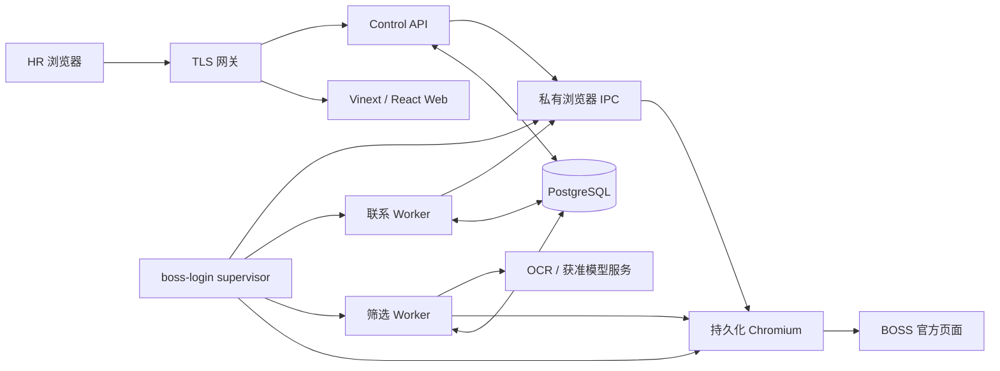

# 系统架构

> 按应用 `100c21b` 核对；运行快照见[当前状态](CURRENT_STATUS.md)。

## 1. 组件与职责



Web 是业务操作入口；API 做身份、岗位授权、校验和审计；PostgreSQL 保存业务事实。浏览器实际操作由受 supervisor 管理的执行面完成，同一账号经锁串行。进程之间使用数据库队列和私有 Unix socket，不依赖 Redis、Kafka 或 Odoo。

| 路径 | 责任 |
| --- | --- |
| `apps/web` | 9 个角色化主导航模块及子页，表单、任务进度、沟通和招聘跟进 |
| `apps/control-api` | API、鉴权、运行一致性、业务路由及隔离 E2E |
| `apps/boss-worker` | 扫码 relay、会话监督、筛选/简历/联系及自有 BOSS 页面适配 |
| `packages/boss-cli-adapter` | 锁定 CLI 版本、命令/解析、账号锁、浏览器 IPC 和外部动作约束 |
| `packages/data` | 迁移、Repository、租约、快照、Outbox 和审计 |
| `packages/contracts` | 类型、校验、人数与日上限语义 |
| `packages/m1-core` / `rule-engine` | 组合规则、确定性证据与判断 |
| `packages/semantic-engine` | 同义词、旧语义 shadow 与招聘 AI 评估连接器 |
| `packages/contact-policy` | 联系策略、时段、额度和控制检查 |

自有浏览器适配与上游补丁已经是系统组成部分，详见[boss-cli 边界](BOSS_CLI_INTEGRATION.md)；不能再描述成“项目不维护任何 DOM 选择器”。

## 2. 登录与会话监督

`login-relay.ts` 在现有 Chromium 中使用官方微信/App入口，保存 `loginMethod` 并输出状态和必要截图。二维码/提示变化更新图片；过期不自动无限刷新。明确的 App 登录提示与安全验证分别处理。

`session-supervisor.ts` 联合检查官方页面认证、CDP、Worker 心跳及 API 运行版本/策略/联系模式，满足条件后管理筛选和联系子进程。短暂 DOM 不可读与明确登录失效不是同一状态；不确定期间不得凭旧 Cookie 宣称认证成功。

Web 根据图片版本避免旧请求覆盖新图，同版本在途下载不会被每次状态轮询取消。所有扫码和手机确认由人完成。

## 3. 岗位、规则与任务身份

- `positions.boss_account_id + boss_job_id` 标识岗位来源。部署的逻辑账号 ID 不代表自动验证了手机用户身份。
- 同步完整 BOSS 目录后，新开放岗位导入；未找到的旧绑定岗位暂停，历史保留。规则不会因同名自动迁移。
- `rule_sets.active_version_id` 指向已发布规则；草稿和退役版本保留。已发布配置不可原地改写。
- 任务创建保存规则版本、来源岗位 ID/名称和官方筛选条件。换账号或换 ID 不会重写历史任务。
- 同一人可跨任务出现，但任务拥有独立状态与证据；当前岗位视图用受约束指针选择最新状态，不搬走旧历史。

数据与身份恢复流程见[账号切换](BOSS_ACCOUNT_SWITCH.md)。

## 4. 筛选与人数目标

```text
立即请求 / 到期计划
→ 校验授权、岗位、规则与幂等键
→ 排队并按账号领取
→ 按绑定岗位 ID 选择推荐列表，应用官方筛选
→ 每波最多 20 人，保存卡片、来源与规则初评
→ 简历读取、完整性检查、OCR / 已有文字、确定性重评估
→ 仅筛选：累计 screened + matched；自动招呼：建立受控联系意图
→ 达目标 / 推荐池耗尽 / 日上限 / 风险停止；否则继续下一波
```

开自动招呼时 `candidate_limit` 比较本任务成功 `greet + sent`；关闭时比较本任务简历已完成且 `matched` 的人数。`candidate_count` 只是采集量，不能用于替代达标判断。默认每账号日自动招呼上限 200，上海自然日，和简历软限额分开。

数据库使用行锁、`SKIP LOCKED`、claim token 与租约处理领取和恢复。同一会话不并行操作两个岗位；实时沟通的浏览器租约也参与调度。

## 5. 联系、沟通与招聘 AI

手工 greet/message 使用各自的预览和确认，自动 greet 由已开启自动招呼的任务策略触发。联系意图与 Outbox 持久化，Worker 在发送前重验账号、岗位、对象、来源、正文/许可、控制与日上限；收到权威回执才记 sent，未知结果进入 uncertain，不能自动重发。

实时沟通使用 `communication_*` 表保存原生会话与消息，结合浏览器租约协调当前页面；在线简历先保存图片，再由后台处理文字和分析。附件接收、求简历、微信及消息是分开的动作，保留对象与回执绑定。

招聘档案、面试、Offer、入职使用 `recruitment_*` 表。聊天来源建档不会伪造筛选任务或成绩；邀请先生成草稿，发送和录入候选人答复是独立事实。

AI 分为两类：

| 路径 | 作用与边界 |
| --- | --- |
| 旧规则 `semantic` / 语义目录 | `off/shadow`，影子结果不替换正式规则结论；active 被禁用 |
| 岗位招聘 AI 辅助评估 | 由规则 `recruitment` 配置、后台分析和 `recruitment_assessments` 管理；展示建议、证据和不确定项，人工负责录用判断 |

模型连接打开不代表每岗位开启 AI。模型不可推断或覆盖 BOSS 平台标签；无证据、格式错误或超时要保存未知/失败原因。源码入口：[招聘评估](../packages/semantic-engine/src/recruitment-assessment.ts)、[沟通简历分析](../apps/boss-worker/src/communication-resume-analysis.ts)。

## 6. 状态与恢复

| 对象 | 主要状态 |
| --- | --- |
| 任务 | queued、running、screening、waiting_review、completed、failed、cancelled |
| 简历 | not_requested、queued、processing、screened、no_text、failed |
| 规则判断 | matched、not_matched、ambiguous、insufficient |
| 审核 | pending、approved、rejected，兼容 not_required |
| 联系 | ready、processing、sent、failed、uncertain、cancelled；隔离模拟为 simulated |

状态不是单一线性链。`waiting_review` 还要结合 `wait_reason_code`；达标停止、等待联系和推荐池耗尽不能混为一谈。异常恢复说明见[运维手册](OPERATIONS_RUNBOOK.md)。

## 7. 数据聚合

| 领域 | 主要表 |
| --- | --- |
| 身份 / 岗位 | departments、users、user_sessions、position_members、positions |
| 规则 / 语义 | rule_sets、rule_versions、rule_templates、rule_replay_runs、semantic_* |
| 执行 | tasks、task_commands、schedules、candidate_snapshots、candidate_position_states |
| 证据 / 审核 | candidates、match_evidence、reviews、recruitment_assessments |
| 联系 | contact_intents、contact_attempts、contact_controls、contact_authorizations、outbox_events、do_not_contact |
| 沟通 | communication_threads、communication_messages、communication_browser_leases、communication_online_resumes |
| 招聘跟进 | recruitment_cases、recruitment_interviews、recruitment_offers、recruitment_onboarding |
| 运营 | audit_logs、account_health、operational_alerts、quota_counters、data_export_jobs |

当前 migration 范围 001–047。旧 Odoo 字段/集成表属于历史兼容，不代表存在 Odoo 运行时；不能因字段名称过时删除历史迁移。后续 schema 修改走批准的新 migration。

## 8. API 导航

下表是接口索引，不是完整 OpenAPI 规范；请求体和权限以源码为准。

| 入口 | 作用 |
| --- | --- |
| `/health` | 服务与数据库健康、release、联系模式及简历策略 |
| `/api/auth/*` | 控制台会话 |
| `/api/boss-login/status`、`image`、`refresh` | 管理员/负责人扫码与运行状态；refresh 接收可选 loginMethod |
| `/api/boss/positions/sync` | 同步当前会话完整岗位目录 |
| `/api/positions/:id/boss-filter-options`、`rules` | 当前岗位选项与版本化规则 |
| `/api/tasks`、`/api/tasks/:id/cancel`、`retry` | 创建/取消/重试，副作用使用幂等键，命令检查版本 |
| `/api/schedules`、`/api/schedules/:id/cancel` | 创建/停用计划 |
| `/api/candidate-position-states/*` | 详情、简历、审核、联系预览与意图 |
| `/api/communication/*` | 会话、同步、消息与原生动作 |
| `/api/automation/*` | 联系控制、审批与就绪检查 |
| 招聘跟进路由 | 见 [lifecycle-routes.ts](../apps/control-api/src/lifecycle-routes.ts) |

普通业务请求使用 Bearer 会话，服务端从会话确定 actor，不接受前端伪造操作者。代码入口：[server.ts](../apps/control-api/src/server.ts)、[沟通路由](../apps/control-api/src/communication-routes.ts)。

## 9. 部署与验证边界

现有生产通过 Compose 运行 PostgreSQL、备份、API、Web、TLS 和 boss-login。所有浏览器任务共用既有持久化会话，profile 不跨系统复制。固定镜像、卷核对和预检见[部署手册](INTRANET_DEPLOYMENT.md)。

单元测试验证逻辑；隔离数据测试验证事务和权限；浏览器 fixture 验证 DOM 行为；现场只读核对证明部署和状态。真实业务结果必须单独说明授权范围与回执，不能用模拟测试替代，详见[验证指南](TESTING.md)。
