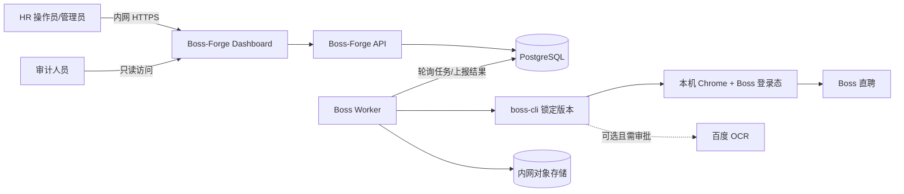
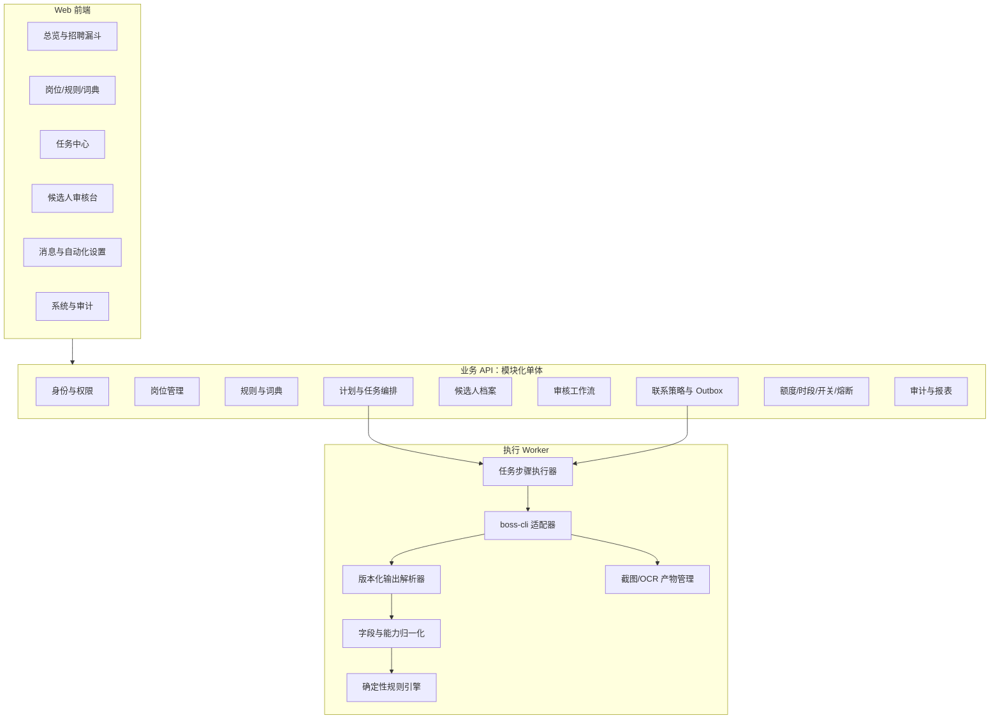
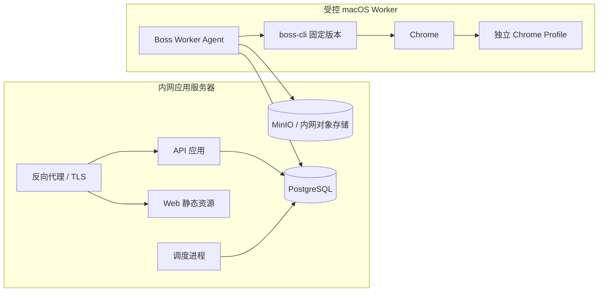
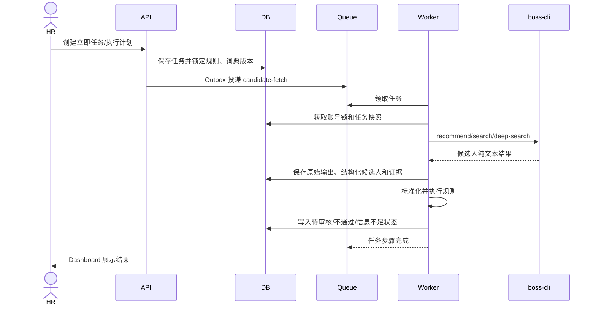
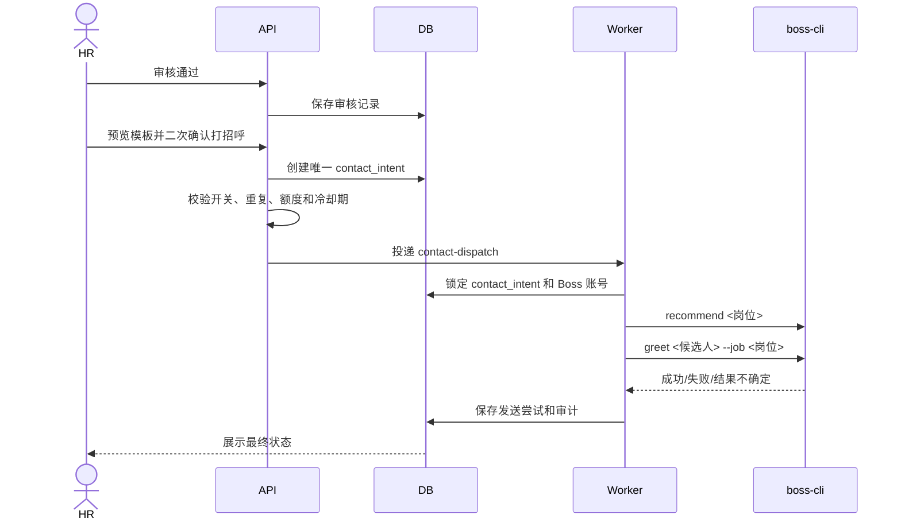

# Boss-Forge 系统架构设计

> 文档版本：V0.3（M1/M2 实现同步版）
>
> 编写日期：2026-08-31
>
> 关联文档：[产品需求文档](HR_DASHBOARD_PRD.md) · [boss-cli 能力复用清单](BOSS_CLI_REUSE_MATRIX.md) · [M1/M2 验收报告](M1_M2_ACCEPTANCE.md)

本文中 M1/M2 部分描述当前已实现架构，M3/M4 部分描述后续演进目标。

## 1. 架构目标

Boss-Forge 是公司内网使用的 HR 招聘工作台。系统负责岗位规则、任务调度、候选人审核、联系策略和审计；所有 Boss 直聘页面操作统一复用 `boss-cli`。

架构需要满足：

1. 第一期严格执行“系统筛选、HR 审核、人工确认打招呼”。
2. 第二期能够在三级开关、额度、时段、去重和熔断控制下自动打招呼。
3. 支持立即执行和定时执行，任务可追踪、可取消、可恢复。
4. 同一 Boss 账号的页面操作严格串行，避免 Chrome 会话冲突。
5. 对候选人筛选结果提供原文证据、标准标签、置信度和规则版本。
6. `boss-cli` 升级、页面变化、登录失效或结果不确定时安全停止。
7. 首期保持简单可维护，同时允许以后增加 Boss 账号和 Worker 节点。

## 2. 核心架构原则

### 2.1 `boss-cli` 是唯一页面操作层

Boss-Forge 不实现 Boss DOM 选择器、页面导航、Chrome/CDP 管理、简历截图、OCR 调用、聊天、消息发送或打招呼。所有这些操作通过锁定版本的 `boss-cli` 完成。

### 2.2 采用模块化单体，不提前拆微服务

一期建议使用一个业务 API 应用、一个异步 Worker 应用和一个 Web 前端。业务模块在代码内明确分层，共用一个 PostgreSQL，不在早期增加分布式事务和多服务运维成本。

需要独立部署 Worker，是因为 `boss-cli` 必须运行在具有 Chrome、Boss 登录态和本地缓存的受控节点上；它与普通业务 API 的运行条件不同。

### 2.3 控制面与执行面分离

- 控制面：用户、规则、审核、任务编排、安全策略和审计。
- 执行面：在指定 Worker 上串行调用 `boss-cli`，返回原始结果和结构化结果。

### 2.4 所有业务决定版本化

任务启动时锁定岗位、规则版本、标准能力词典版本、消息模板版本和联系策略版本。后续配置修改不改变正在运行和已经完成的历史结果。

### 2.5 发送操作以安全和幂等为最高优先级

任何“发送结果不确定”的情况都进入人工核验，不自动重试。系统宁可漏发，也不能重复打招呼或重复发送消息。

## 3. 系统上下文



边界说明：

- HR 不直接接触 Worker 或 CLI，只操作 Dashboard。
- API 不直接控制 Chrome，只投递经过校验的业务任务。
- Worker 是唯一允许启动 `boss-cli` 子进程的组件。
- OCR 未经审批时设置 `BOSS_RESUME_OCR=0`，不连接百度，只保存本地简历截图。

## 4. 总体组件设计



## 5. 组件职责

### 5.1 Web 前端

建议采用 React + TypeScript。主要职责：

- 展示任务、候选人、规则证据和招聘漏斗。
- 提供规则、词典、计划和模板的可视化编辑。
- 第一期提供明确的人工审核和发送二次确认。
- 第二期提供全局、岗位、任务三级自动开关和紧急停止。
- 不保存 Boss Cookie、CLI 密钥或百度 OCR 密钥。
- 不直接调用 Worker 或执行 CLI。

### 5.2 业务 API

建议采用 Node.js + TypeScript 的模块化后端。主要职责：

- 统一身份认证、RBAC 权限和请求审计。
- 管理岗位、规则、词典、模板和所有版本快照。
- 接收立即任务，生成定时任务实例。
- 管理候选人状态、人工审核和联系意图。
- 在发送前执行开关、时段、额度、重复联系和冷却期校验。
- 通过事务 Outbox 投递任务，避免数据库已提交但队列消息丢失。
- 提供报表查询，不参与 Boss 页面操作。

### 5.3 任务调度与队列

M1/M2 当前使用 PostgreSQL 作为任务与 Outbox 的事实来源：

- M1 Worker 轮询 `tasks`，通过 `FOR UPDATE SKIP LOCKED` 原子领取立即或定时筛选任务。
- 调度循环扫描到期 `schedules`，按 `schedule_id + scheduled_for` 幂等生成任务实例。
- 联系确认在同一事务内写入 `contact_intents` 与 `outbox_events`。
- 联系 Worker 原子领取 Outbox，执行前再次检查时段、限额、冷却期和紧急停止。
- 同一 Boss 账号通过本地进程锁串行调用 `boss-cli`。

当前规模无需 Redis/BullMQ。未来扩展到多 Worker、多主机或更高吞吐量时，可在不改变 PostgreSQL 业务事实来源的前提下增加消息队列。

### 5.4 Boss Worker

Worker 部署在能够运行本机 Chrome 的受控节点。职责：

- 向控制面定期上报在线状态、CLI 版本、Chrome 状态和可用 Boss 账号。
- 获取账号级锁；当前使用 Worker 本地文件锁，多主机部署前升级为分布式锁。
- 按“命令配方”执行一组有前置关系的 CLI 命令。
- 捕获退出码、标准输出、标准错误、超时和取消信号。
- 保存脱敏原始输出，由版本化解析器转换成内部 DTO。
- 如后续批准简历截图/OCR，再上传产物并返回引用；当前流程默认关闭该能力。
- 任何验证码、登录失效、页面异常或不确定发送结果立即停止。

### 5.5 `boss-cli` 适配器

适配器是薄层，不包含页面选择器和 Boss 页面逻辑。

内部调用示例：

```ts
type BossCommand =
  | { type: "positions" }
  | { type: "jd"; positionName: string }
  | { type: "recommend"; jobKeyword?: string }
  | { type: "search"; keyword?: string }
  | { type: "deepSearch"; jobKeyword?: string; core: string[]; bonus: string[]; match: boolean }
  | { type: "preview"; candidateTarget: string }
  | { type: "greet"; candidateTarget: string; jobKeyword?: string }
  | { type: "chatByIndex"; index: number; unreadOnly: boolean }
  | { type: "send"; text: string; requestResume: boolean }
  | { type: "action"; action: "resume" | "not-fit" | "remark" | "agree-resume" | "request-attachment-resume" | "history" | "wechat"; remark?: string };
```

执行要求：

- 使用 `spawn(binary, argv, { shell: false })`，禁止字符串拼接 Shell 命令。
- 可执行文件路径和 CLI 版本由系统配置，不接受前端传入。
- 每个命令设置超时、最大输出尺寸和取消信号。
- 环境变量使用最小白名单，不把系统全部环境透传给子进程。
- 输出解析器按 `boss-cli` 版本注册；无法识别的输出直接失败，不静默猜测。
- 生产环境禁止从 Dashboard 调用 `boss update`。

### 5.6 命令配方

部分 CLI 命令依赖当前页面，系统必须把它们封装成可审计的命令配方：

| 配方 | 命令顺序 | 用途 |
|---|---|---|
| 推荐候选人 | `recommend <岗位>` | 获取推荐列表 |
| 深度匹配 | `deep-search <岗位> --core ... --bonus ...` → `deep-search --match` | 先同步条件，再明确消耗匹配次数 |
| 推荐页预览 | `recommend <岗位>` → `preview <候选人>` | 重新建立正确页面上下文后预览 |
| 推荐页打招呼 | `recommend <岗位>` → `greet <候选人> --job <岗位>` | 第一期人工批准或第二期策略批准后执行 |
| 聊天发送 | `list` → `chat --index <序号>` → `send --text <内容>` | 通过列表上下文打开会话后发送 |
| 聊天候选人操作 | `list` → `chat --index <序号>` → `action <操作>` | 备注、简历、沟通记录等 |

每一步单独记录状态、输入摘要、输出、耗时和错误。前一步失败时不得继续后续步骤。

### 5.7 规则与标准能力词典

规则引擎使用确定性处理链：

```text
原始候选人文本
  → 字段清洗
  → 别名/同义词匹配
  → 否定、备考、未通过等上下文识别
  → 标准能力标签和原文证据
  → 硬性/排除条件
  → 加分和排序
  → 满足 / 不满足 / 信息不足 / 有歧义
```

规则引擎要求：

- 输入为不可变的候选人快照、规则版本和词典版本。
- 输出每个条件的判断、原文证据、标准标签、置信度和原因码。
- 低置信度或冲突结果进入人工复核。
- 不使用大模型直接作最终通过/淘汰决定。
- 后续如使用大模型，只把它作为证据抽取器，确定性规则负责最终判断。

## 6. 部署架构

### 6.1 推荐生产拓扑



### 6.2 一期最小部署

一期可在一台内网服务器部署 Web、API 和 PostgreSQL，在一台专用 macOS 机器运行 Worker、Chrome 和 `boss-cli`。只有启用简历截图时才需要内网对象存储。

如果技术验证只有一个用户，也可以临时把 API 和 Worker 部署在同一台 macOS 上，但代码仍保持控制面/执行面边界，避免后续迁移时重写。

### 6.3 多账号扩展

- 首选一个 Boss 账号绑定一个 Worker 或独立 macOS 用户，获得最清晰的登录态、缓存和进程隔离。
- `boss-cli` 支持通过 `BOSS_BROWSER_USER_DATA_DIR`、`BOSS_BROWSER_PROFILE_DIRECTORY` 和 `BOSS_BROWSER_REMOTE_DEBUGGING_PORT` 隔离 Chrome 登录态与调试端口。
- 但其 JD、截图、OCR 和 `session.lock` 默认仍位于当前用户的 `~/.boss-cli/`，因此同一 macOS 用户下多账号会共享部分缓存并被同一个会话锁串行化；一期不采用这种部署方式。
- 账号绑定默认 Worker，可在管理员批准后迁移。
- 调度器依据账号选择队列分区。
- 账号级锁确保严格串行；部署在不同 Worker/操作系统用户下的不同账号可以并行。
- Worker 离线时任务保留在队列，不自动切换到没有该账号登录态的节点。

## 7. 核心业务流程

### 7.1 立即或定时筛选



### 7.2 第一期人工打招呼



### 7.3 第二期自动打招呼

自动化不绕过审核规则，而是把“人工最终确认”替换为策略批准：

1. 候选人满足高置信度规则，不存在信息不足或歧义。
2. 全局、岗位、任务三级开关同时开启。
3. 当前处于允许时段。
4. 未达到账号、岗位、任务的额度。
5. 未重复联系，且不在跨岗位冷却期。
6. 账号、Worker、CLI、Chrome 和登录态健康。
7. 未触发失败熔断或紧急停止。
8. 创建唯一联系意图后再投递执行。

任一条件不满足时不发送，记录明确原因码。

## 8. 状态机

### 8.1 任务状态

```text
scheduled → queued → running → waiting_review → completed
                       ├────────→ partial_failed
                       ├────────→ failed
                       └────────→ cancelling → cancelled
```

- `waiting_review` 表示候选人已处理完成，等待 HR 审核，不占用 Worker。
- `partial_failed` 表示已有可用结果，但部分候选人或步骤失败。
- 取消只阻止未开始步骤；正在执行的 CLI 进程收到取消信号后安全退出。

### 8.2 候选人岗位状态

```text
fetched
  → insufficient / rule_rejected / pending_review
  → review_approved / review_rejected
  → pending_contact
  → contacted / contact_failed / contact_unknown / skipped
```

### 8.3 联系意图状态

```text
draft → approved → queued → dispatching → succeeded
                                  ├──────→ failed_retryable
                                  ├──────→ failed_final
                                  └──────→ unknown_needs_review
```

`unknown_needs_review` 不允许自动重试，必须由 HR 在 Boss 页面核验后人工关闭或重新创建联系意图。

## 9. 数据架构

### 9.1 核心表

| 表 | 主要内容 |
|---|---|
| `users`, `roles`, `user_roles` | 内网用户和 RBAC |
| `boss_accounts` | Boss 账号、状态、绑定 Worker、全局开关 |
| `worker_nodes` | Worker 在线状态、CLI/Chrome 版本和容量 |
| `positions` | Boss 岗位镜像、状态、负责人和同步时间 |
| `rule_sets`, `rule_versions` | 岗位筛选规则及不可变版本 |
| `dictionary_items`, `dictionary_versions` | 标准能力、别名、否定和易混淆项 |
| `schedules` | 一次性或周期计划 |
| `tasks`, `task_steps` | 任务实例、命令配方步骤和状态 |
| `candidates` | 候选人主档及临时身份指纹 |
| `candidate_snapshots` | 每次采集到的原始/标准化字段快照 |
| `candidate_position_states` | 候选人与岗位的规则、审核和联系状态 |
| `match_evidence` | 原文、标准标签、置信度、条件和原因码 |
| `reviews` | HR 审核结论、备注和纠错 |
| `message_templates`, `template_versions` | 消息模板及版本 |
| `contact_intents`, `contact_attempts` | 联系意图、幂等键、执行尝试和结果 |
| `artifacts` | 简历截图、OCR 文本、哈希、存储位置和保留期 |
| `quota_counters` | 账号/岗位/任务的每日额度计数 |
| `outbox_events` | 事务性队列投递 |
| `audit_logs` | 仅追加审计记录 |

### 9.2 候选人身份与去重

`boss-cli` 当前主要基于页面列表和姓名操作，未保证提供长期稳定候选人 ID。因此身份分两层：

- `source_reference`：任务、岗位、页面来源、列表序号/上下文等当次定位信息，用于执行 CLI 配方。
- `candidate_fingerprint`：标准化姓名、当前职位、公司、学校、工作年限等可用字段生成的内部指纹，用于提示可能重复。

指纹不是平台永久 ID。低置信度合并必须由 HR 确认，不能静默合并两个同名候选人。

### 9.3 产物存储

- PostgreSQL 保存结构化字段、OCR 文本引用、哈希和元数据。
- PNG 简历截图放入 MinIO 或公司批准的内网对象存储。
- 路径不使用候选人真实姓名，使用随机对象 ID。
- 访问通过短期签名 URL 或 API 鉴权代理。
- 按公司批准的招聘数据保留期自动过期，并留下不含个人内容的删除审计。

## 10. API 边界

建议 REST API：

| 资源 | 示例接口 |
|---|---|
| 岗位 | `GET /positions`、`POST /positions/{id}/sync` |
| 规则 | `POST /rule-sets`、`POST /rule-sets/{id}/versions` |
| 词典 | `GET /dictionary-items`、`POST /dictionary-versions` |
| 计划 | `POST /schedules`、`PATCH /schedules/{id}` |
| 任务 | `POST /tasks`、`GET /tasks/{id}`、`POST /tasks/{id}/cancel` |
| 候选人 | `GET /candidates`、`GET /candidate-position-states/{id}` |
| 审核 | `POST /candidate-position-states/{id}/reviews` |
| 联系 | `POST /candidate-position-states/{id}/contact-intents` |
| 自动化 | `PATCH /automation/global`、`PATCH /positions/{id}/automation` |
| 紧急停止 | `POST /automation/emergency-stop` |
| 审计 | `GET /audit-logs` |

所有写接口支持 `Idempotency-Key`。规则、审核、联系和开关修改使用乐观锁版本号，避免多人同时覆盖。

## 11. 幂等、并发和一致性

### 11.1 幂等键

- 定时任务：`schedule_id + scheduled_at` 唯一。
- 立即任务：客户端 `Idempotency-Key` 唯一。
- 候选人写入：`task_id + source_reference` 唯一。
- 联系意图：`boss_account + position + candidate_identity + action + policy_window` 唯一。
- CLI 步骤：`task_step_id + attempt_no` 唯一。

### 11.2 锁顺序

执行页面操作时统一按以下顺序加锁，避免死锁：

1. 联系意图或任务步骤数据库行锁。
2. Boss 账号锁；当前为 Worker 本地文件锁，多主机部署前升级为分布式锁。
3. Worker 本地进程互斥锁。
4. 调用 `boss-cli`，并尊重其会话锁。

### 11.3 Outbox

业务状态和 `outbox_events` 在同一 PostgreSQL 事务中提交。联系 Worker 通过行锁领取待处理事件，完成后写入联系尝试、候选人状态、额度计数和审计日志。消费者重复收到同一幂等键时直接返回已有结果，不再次执行外部操作。

## 12. 安全设计

### 12.1 身份与权限

- 内网 HTTPS，优先接入公司 SSO/OIDC。
- 角色：HR 操作员、HR 管理员、系统管理员、审计只读。
- 自动开关、批量联系、紧急停止和导出属于高风险权限。
- 高风险操作要求二次确认，并记录操作者、对象、前后值和请求 ID。

### 12.2 密钥和登录态

- Boss Cookie 和 Chrome Profile 只存在 Worker 节点，不进入 API 数据库。
- OCR 密钥保存在 Worker 的系统密钥管理或受控环境文件中，不进入 Git、队列和日志。
- API 与 Worker 使用独立服务身份；跨节点通信使用 TLS 和短期凭证。
- 子进程环境变量采用白名单透传。

### 12.3 数据保护

- 数据库、对象存储和备份加密。
- 简历、OCR、消息和手机号等字段按角色脱敏。
- 导出行为记录审计并设置有效期。
- 日志禁止记录 Cookie、访问令牌、OCR 密钥和完整简历正文。

### 12.4 操作安全

- 不绕过验证码、人机校验、平台额度或访问控制。
- 自动联系默认关闭，部署、升级、重启和故障恢复后保持关闭状态，除非持久化策略明确允许恢复。
- 紧急停止写入数据库并广播到所有 Worker；Worker 在每个 CLI 步骤开始前重新检查。

## 13. 限额与熔断

联系前按以下顺序校验：

```text
紧急停止
→ 全局开关
→ 岗位开关
→ 任务开关
→ 候选人规则与审核状态
→ 重复联系和冷却期
→ 允许发送时段
→ 账号/岗位/任务额度
→ Worker/CLI/登录态健康
→ 创建并锁定联系意图
```

熔断条件建议：

- 连续 CLI 失败达到阈值。
- 连续输出解析失败。
- 登录失效、验证码或人机验证。
- 发送结果不确定。
- 页面前置条件反复不满足。
- Worker 心跳超时或 CLI 版本不符合要求。

熔断范围分账号级、Worker 级和全局级，恢复必须有管理员操作和审计记录。

## 14. 错误处理与恢复

| 错误类型 | 是否自动重试 | 处理方式 |
|---|---|---|
| 队列暂时不可用 | 是 | 指数退避，保持 Outbox 未投递状态 |
| Worker 临时离线 | 是 | 保留任务，等待绑定 Worker 恢复 |
| CLI 启动失败 | 有限 | 重试后熔断，记录版本和路径 |
| CLI 读取类命令超时 | 有限 | 重新建立页面配方后重试 |
| 登录失效/验证码 | 否 | 暂停账号，通知管理员人工处理 |
| 输出无法解析 | 否 | 保存脱敏原文，标记适配器不兼容 |
| 简历每日预览次数或频率受限 | 否 | 标记信息不足，停止本日预览 |
| 打招呼明确失败 | 按原因 | 只有确定未发送且错误可重试时才允许有限重试 |
| 打招呼结果不确定 | 否 | `unknown_needs_review`，必须人工核验 |
| 规则执行失败 | 是 | 不调用任何联系操作，修复后可回放规则 |

## 15. 可观测性

### 15.1 日志

统一结构化日志字段：

- `request_id`、`user_id`、`task_id`、`task_step_id`
- `boss_account_id`、`worker_id`
- `command_type`、`cli_version`、`attempt_no`
- `duration_ms`、`exit_code`、`result_code`

日志仅保留参数摘要和脱敏输出，不记录密钥、Cookie 或完整简历。

### 15.2 指标

- 任务排队时间、运行时间、成功率、部分失败率。
- CLI 命令成功率、超时率、解析失败率。
- Worker 心跳、账号锁等待时间、Chrome/登录态健康。
- 候选人获取数、规则通过率、信息不足率、人工通过率。
- 同义表达归一化准确率和 HR 纠错率。
- 打招呼成功、失败、结果不确定、重复拦截和额度拦截数量。

### 15.3 告警

- Worker 离线、账号登录失效、验证码、人机验证。
- CLI 版本不一致、连续解析失败、失败熔断。
- 发送结果不确定、异常发送量、额度即将耗尽。
- Outbox 积压、队列积压、数据库或对象存储异常。

## 16. 推荐技术栈

| 层 | 推荐选型 | 原因 |
|---|---|---|
| Web | React + TypeScript + Vinext/Vite | 当前 Dashboard 技术栈，适合内网管理台 |
| API | Node.js 22+ + TypeScript `node:http` | 当前轻量控制 API，与 Worker 共享类型和数据访问层 |
| Worker | Node.js 22+ + TypeScript | 直接管理 CLI 子进程，复用 DTO 和校验代码 |
| 数据库 | PostgreSQL 16+ | 事务、JSONB、锁和审计查询可靠 |
| 队列/锁 | PostgreSQL 行锁 + Worker 本地账号锁 | 当前 M1/M2 实现，无额外队列基础设施 |
| 对象存储 | MinIO 或公司已有 S3 兼容存储 | 简历截图与产物不进入数据库 |
| 认证 | 公司 OIDC/SSO | 统一身份和离职回收 |
| 数据校验 | TypeScript 类型 + API 边界校验 | 当前控制 API 和 CLI 解析结果共享类型契约 |
| 数据迁移 | SQL migration + `postgres` 客户端 | 当前版本化数据库结构与仓储实现 |
| 可观测性 | OpenTelemetry + Prometheus/Grafana + 集中日志 | 统一请求、任务和 CLI 步骤追踪 |

一期不建议引入 Kubernetes。使用 Docker Compose 部署控制面，Worker 作为受控 macOS 服务运行即可。业务量和运维需求明确增长后再评估容器编排。

## 17. 建议代码结构

```text
Boss-Forge/
├── apps/
│   ├── web/                  # React Dashboard
│   ├── control-api/          # 控制 API、seed 与用户流程 E2E
│   └── boss-worker/          # M0/M1 Worker 与受控联系执行器
├── packages/
│   ├── contracts/            # 共享契约
│   ├── boss-cli-adapter/     # argv 构造、版本化解析器、命令配方
│   ├── rule-engine/          # TEM8 标准化和确定性规则
│   ├── m1-core/              # 候选人评估流程
│   ├── contact-policy/       # 联系安全策略
│   └── data/                 # SQL migration、类型与 repositories
├── docs/                     # PRD、架构、运行与验收文档
└── design-system/            # Dashboard 设计规范
```

## 18. 测试策略

### 18.1 单元测试

- 规则、词典、否定识别和原因码。
- 联系策略、额度、冷却期和三级开关。
- 状态机和幂等键生成。
- CLI argv 构造，确保不存在 Shell 注入。

### 18.2 CLI 契约测试

- 为锁定的 `boss-cli` 版本保存脱敏输出样本。
- 每条命令测试成功、空结果、前置页面错误、登录失效和格式变化。
- 新版本升级时先运行所有解析器契约测试。
- 契约失败禁止部署，不使用模糊解析兜底。

### 18.3 集成测试

- PostgreSQL 事务 Outbox 与重复消费。
- PostgreSQL 任务领取、定时物化、Outbox、重复消费和账号锁。
- Worker 离线/恢复与任务续跑。
- 对象存储权限和过期删除。

### 18.4 端到端测试

- 默认使用不发送模式和专用测试账号。
- 真实 `greet`、`send`、`not-fit`、`wechat` 等有外部影响的动作必须由测试负责人单独批准。
- 真实联系验收前验证未经人工二次确认无法创建可执行联系意图。

## 19. 分阶段实施

### M0：技术验证

- 安装并锁定 `boss-cli` 版本。
- 跑通 Worker 心跳、账号锁、命令执行和版本化输出解析。
- 验证岗位、推荐/搜索和真实操作的显式批准机制；简历截图与真实打招呼按安全边界暂不执行。
- 确认 OCR 是否获批，未获批则关闭。

### M1：数据与规则闭环

- 岗位、规则、词典、候选人、任务和证据数据模型。
- 立即任务、候选人采集、标准化、去重和审核台。
- TEM8 等首批规则测试集。

### M2：定时筛选与受控联系

- 定时计划、任务中心、人工审核、消息预览和人工确认联系意图。
- Outbox、幂等、限额、允许时段、冷却期、审计和故障恢复。
- 真实执行必须同时具备命令行批准参数和环境总开关；默认关闭。

### M3：第一阶段试运行

- 连续试运行 2～4 周，统计准确率、召回率、有歧义率和重复联系率。
- 审核 HR 纠错数据并发布新词典版本，历史结果保持可追溯。
- 达到验收指标后进入自动联系上线审批。

### M4：第二期受控自动化

- 全局/岗位/任务三级开关。
- 自动策略批准、冷却期、熔断和紧急停止。
- 仅对高置信度、无歧义候选人开放。

## 20. 架构决策摘要

| 决策 | 结论 |
|---|---|
| Boss 页面操作 | 只调用 `boss-cli`，不重复实现 |
| 应用形态 | Web + 模块化单体 API + 独立 Worker |
| 服务拆分 | 一期不采用微服务 |
| 数据库 | 单一 PostgreSQL 作为业务事实来源 |
| 异步执行 | PostgreSQL 任务表 + PostgreSQL Outbox；未来按规模可增加消息队列 |
| CLI 并发 | 同一 Boss 账号严格串行 |
| 浏览器登录态 | 只保存在绑定 Worker 的 Chrome Profile |
| 简历文件 | 内网对象存储，数据库保存引用和哈希 |
| 规则判断 | 版本化确定性规则，大模型最多辅助抽取证据 |
| 自动联系 | 默认关闭，三级开关 + 幂等 + 限额 + 熔断 |
| 不确定发送结果 | 禁止自动重试，转人工核验 |
| 部署 | 控制面 Docker Compose，Worker 为 macOS 服务 |

## 21. 待确认问题

1. 公司是否已有 OIDC/SSO、PostgreSQL 和对象存储，可直接复用。
2. 首期管理一个还是多个 Boss 账号，以及账号与岗位的归属关系。
3. Worker 是否有专用 macOS 设备，是否允许长期保持 Chrome 登录态。
4. 百度 OCR 是否通过隐私与安全审批；若不通过，一期是否接受仅截图人工查看。
5. 候选人简历、OCR、消息和审计数据的保存期限。
6. 告警接入企业微信、邮件还是公司现有监控平台。
7. 第一期批量人工联系是否允许，最大批次是多少。
8. 第二期自动打招呼的每日上限、允许时段、冷却期和审批人。
